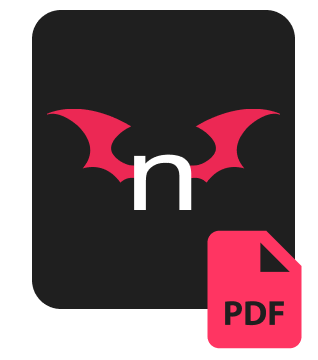
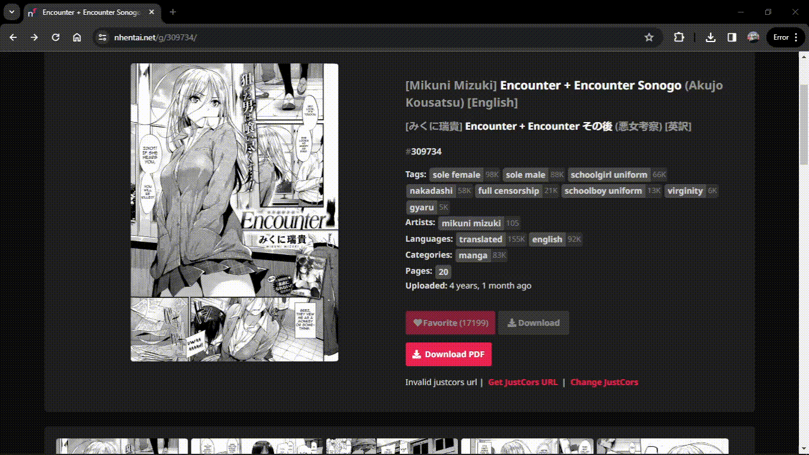
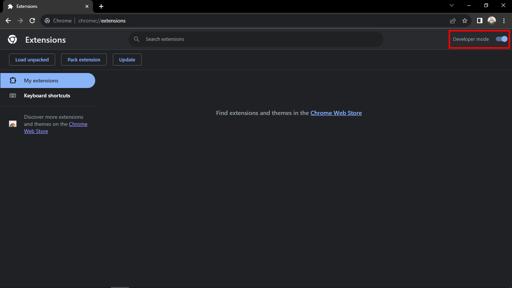
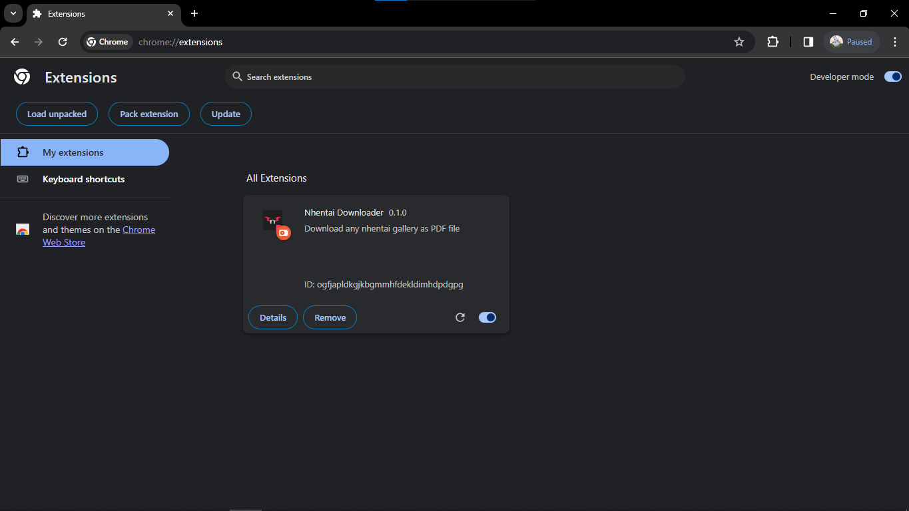

    
    <h1>Nhentai Gallery PDF Downloader</h1>

## What is this?

This extension add additional download button when visiting [gallery](https://nhentai.net/g/) page that automatically convert all the pages into PDF file.

## Requirements?

In order to use this extension, you must have [JustCors](https://justcors.com) URL. You can use **temporary URL** or use **permanent URL** provided by JustCors.

## Temporary URL?

Temporary URL can be easily be found on [JustCors index page](https://justcors.com) but it expires every morning so you have to change it every once a day.

## Permanent URL?

Not like temporary URL, Permanent URL is persistent. Meaning you only have to get it once. You can get it on [JustCors index page](https://justcors.com) and enter your email address in the provided input. You will get an email containing your own justcors URL dashboard that also contain your own permanent URL.

But permanent URL has limited usage **100k request/month**.

## How to install this extension?

### Chrome:

-   [Download](https://github.com/mangadi3859/youtube-block-bypass-extension/archive/refs/heads/main.zip) the zip file.

-   Extract the zip file.

-   Open chrome and go to [chrome://extensions](chrome://extensions).

-   Turn on **Developer Mode** in the top right corner.
    

-   Click **Load unpacked** button in the left corner. If this button doesn't show, make sure the developer mode is enabled.

-   You will be brought to the file explorer, find and select the file you just extracted. It should be a folder.

-   After that you should find an extension called **Nhentai Downloader**
    

-   Now you can try to visit [nhentai.net](https://nhentai.net) and try to download your favorite doujins.

## Change Log

### Version 0.1.0

-   Initial Release
